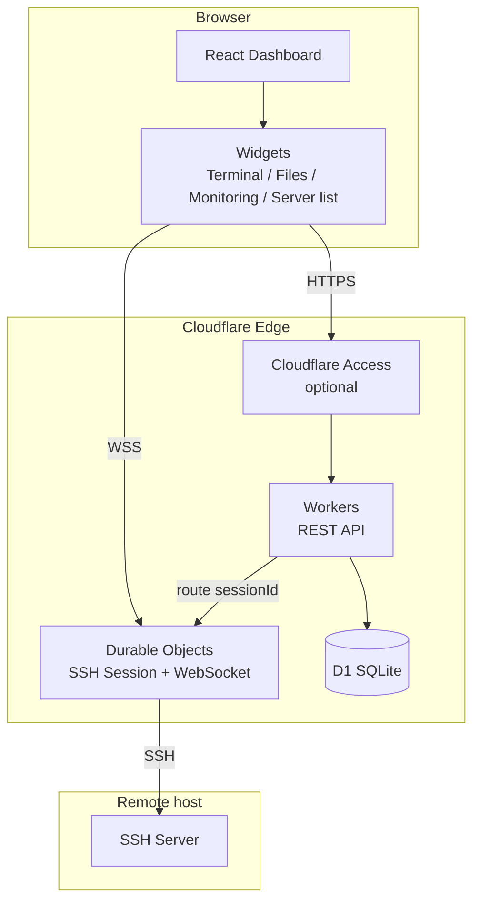

> [← README](https://github.com/HaradaKashiwa/ternssh/blob/main/README.en.md) · [Wiki](Home) · [中文](zh-Home)
>
> [Overview](en-Home) · [Features](en-Features) · [Tech Stack](en-Tech-Stack) · [Quick Start](en-Getting-Started) · [Deployment](en-Deployment) · [Docker](en-Docker) · [Project Structure](en-Project-Structure) · **Architecture** · [Widgets](en-Widgets) · [API](en-API) · [Database](en-Database) · [Settings](en-Settings) · [Security](en-Security) · [Configuration](en-Configuration) · [Roadmap](en-Roadmap) · [License](en-License)

## Architecture

