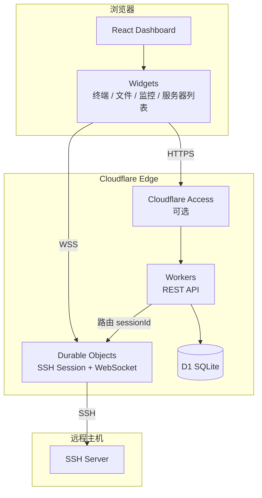

> [← README](https://github.com/HaradaKashiwa/ternssh/blob/main/README.md) · [Wiki](Home) · [English](en-Home)
>
> [简介](zh-Home) · [功能特性](zh-Features) · [技术栈](zh-Tech-Stack) · [快速开始](zh-Getting-Started) · [部署](zh-Deployment) · [Docker](zh-Docker) · [项目结构](zh-Project-Structure) · **系统架构** · [小部件](zh-Widgets) · [API](zh-API) · [数据库](zh-Database) · [设置](zh-Settings) · [安全](zh-Security) · [配置](zh-Configuration) · [路线](zh-Roadmap) · [License](zh-License)

## 系统架构

